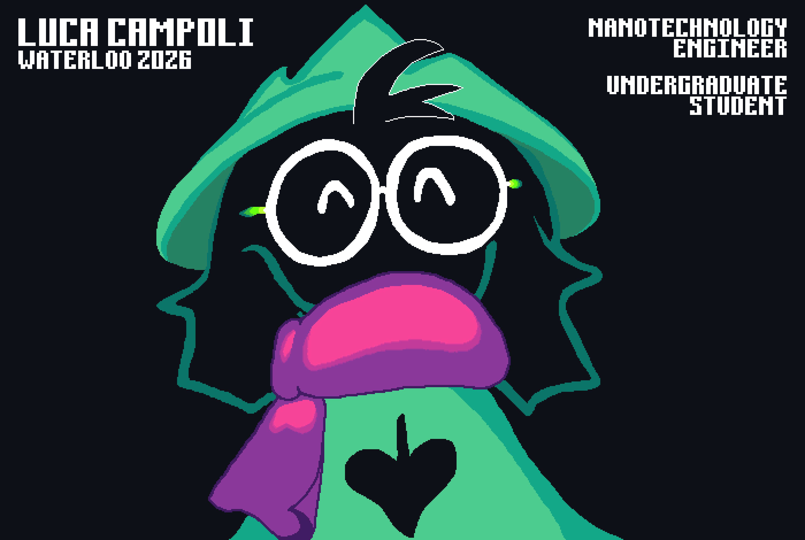

<!-- 
 text formatting -->

<h2>Hello!</h2>

<h3>I'm Luca Campoli</h3>

Email: lucacampoli36@gmail.com  
Instagram: @luca_campoli36  
<a href="www.linkedin.com/in/luca-campoli-64059b202">LinkedIn</a>

 

<h4>Currently Studying At:</h4>

University of Waterloo 🦆 - Nanotechnology Engineering

 

<h4>Previous Project:</h4>
<a href="https://github.com/LucaCampoli/Vlad-Vacuum">Vlad Vacuum</a> 

For: York Region Skills Competition  
Role: Lead Developer & Sprite Artist

 

<h4>Hobbies:</h4>
<ul>
<li> Swimming
<li> Video Game Development
<li> Pixel Art
</ul>
 

<h4>Interests:</h4>
<ul>
<li> Python Programming (3 yrs experience)
<li> Java Programming (1 yr experience)
<li> Robotics & Machine Learning
<li> Video Games
</ul>